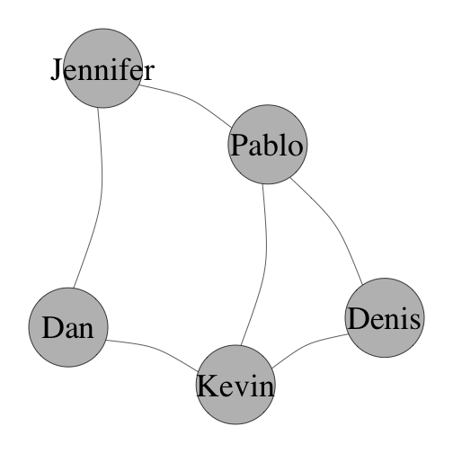

Social network analysis
========================================================
author: Pablo Barberá
date: January 22, 2016

========================================================
title: false

  
Moreno, _Who Shall Survive?_, 1934

========================================================
title: false

  
Moreno, _Who Shall Survive?_, 1934

========================================================
title: false

  
Moreno, _Who Shall Survive?_, 1934

========================================================
title: false

  
Moreno, _Who Shall Survive?_, 1934

========================================================


Christakis & Fowler, NEJM, 2007

========================================================


Adamic & Glance, 2004, IWLD

========================================================

  
[Email network of a company](http://www.orgnet.com/email.html)

========================================================

  
Barberá et al, 2015, Psychological Science

Outline
========================================================

Social network analysis:  
- Basic concepts
- Importing network data into R
- Network visualization
- Node and network-level summary statistics
- Community detection
- Network modeling


Basic concepts
========================================================

__Node__ (vertex): each of the objects in the graph

__Edge__ (tie): each of the connections between nodes. 

Two __types of edges__:
- Undirected: symmetric connection, represented by lines.
- Directed: imply direction, represented by arrows.

A __graph__ consists of a set of nodes and edges.

A few examples
========================================================
incremental: true

- Classroom: students / friendships
- Twitter: users / retweets
- Academic literature: papers / citations
- Internet: websites / hyperlinks
- Trade: countries / trade flows
- Biology: neurons / connections


========================================================
title: true

Network visualization:  

 

***
Adjacency matrix:  

```
         Jennifer Pablo Dan Kevin Denis
Jennifer        0     1   1     0     0
Pablo           1     0   0     1     1
Dan             1     0   0     1     0
Kevin           0     1   1     0     1
Denis           0     1   0     1     0
```

Edgelist:  

```
     Node1      Node2  
[1,] "Jennifer" "Pablo"
[2,] "Jennifer" "Dan"  
[3,] "Pablo"    "Kevin"
[4,] "Pablo"    "Denis"
[5,] "Kevin"    "Denis"
[6,] "Dan"      "Kevin"
```

