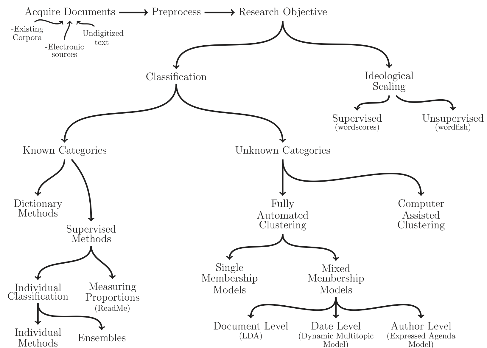

[&laquo; Text Analysis Module](../text/README.md)

Machine learning can be defined as a set of probabilistic methods that can automatically detect patterns in data and use that information to make predictions in other data. Machine learning methods are at the center of most data science machinery, including those which have to do with text. 

We are going to explore two types of machine learning methods in this section: document classification and topic modeling. Document classification is a best used when you know the categories you are trying to predict, while topic modeling better-suited when you do not know these categories. This image from Grimmer and Stewart (2013) is a good visual for where the divisions occur.




## Document Classification

Document classification is in a class of methods known as "supervised machine learning," which just means that there are humans "supervising" the process of annotation with known categories. This process involves "training" a classifier on a subset of documents, then using that classifier to classify a "test" set of documents. 

First, load the `tm` package which we used in the last section, as well as the `RTextTools` package, which has documentation [here](https://cran.r-project.org/web/packages/RTextTools/RTextTools.pdf). `RTextTools` provides functions for document classification, as well some handy functions which simplifies some of the preprocessing we did with `tm`.

The function `create_table` makes a `DocumentTermMatrix` and applies a number of preprocessing transformations by default, including converting to lowercase and stripping whitespace. We will also specify that we want stemming, that we want to keep in punctuation (because emoticons :-D >:( can be important for classification), and we want to use the tf-idf weighting.

```{r message=FALSE}
library(tm)
# install.packages("RTextTools")
library(RTextTools)

df.tweets <- read.csv("bullying.csv", stringsAsFactors = FALSE)
dtm       <- create_matrix(df.tweets$text, language="english", stemWords = TRUE, weighting = weightTfIdf, removePunctuation = FALSE)
dtm
```

We will replace "y" with "1" and "n" with "0" for the `bullying_traces` column, which indicates whether that particular tweet refers to potential bullying. Convert the column to a `numeric` type.

```{r}
df.tweets$bullying_traces[df.tweets$bullying_traces == 'y'] <- 1
df.tweets$bullying_traces[df.tweets$bullying_traces == 'n'] <- 0
df.tweets$bullying_traces <- as.numeric(df.tweets$bullying_traces)
```

We will use 90% of the data for the training set and 10% for the test set. Then, we will create a container which can be used with `RTextTools` models.

```{r}
training_break <- as.integer(0.9*nrow(df.tweets))
container      <- create_container(dtm, t(df.tweets$bullying_traces), trainSize=1:training_break, testSize=training_break:nrow(df.tweets), virgin=FALSE)
```

Now we can train and cross-validate a supervised learning model. We can see which ones are available with print_algorithms().

```{r}
print_algorithms()
```

Ideally, we would play around with multiple classifiers and find the one which works the best for the task. But for this workshop, we will choose the [Support Vector Machine](https://en.wikipedia.org/wiki/Support_vector_machine) (SVM). 

Cross-validation is a process of breaking up the training set into _k_ folds, using _k - 1_ folds as a training set and testing it against the last fold. We will use 3 folds. 

Accuracy is a measure defined as true positives + true negatives / the total population of items. It is equivalent to the proportion of correctly predict cases, and considered here a rough metric of model performance.


```{r}
cv.svm <- cross_validate(container, 3, algorithm = 'SVM', kernel = 'linear')
cv.svm$meanAccuracy
```

How good is this result? One way to think about is to compare with different random benchmarks. Since we have two categories, one benchmark would be 50%. Another one would be always choosing the modal category.

```{r}
prop.table(table(df.tweets$bullying_traces))
```

The metrics of [precision, recall, and F-score](https://en.wikipedia.org/wiki/Precision_and_recall) are somewhat more descriptive than accuracy. _Precision_ is the proportion of classified documents which are selected (\% correct positives), while _recall_ is the number of relevant documents which have been selected (\% true values correctly predicted). 

In the supervised learning example, a high precision indicates that the classifier can correctly classify documents without many false hits, while a high recall indicates that it can retrieve a high number of correctly classifed documents. _F1-score_ is the harmonic mean of the two metrics.

Now we can train the model, apply the trained model to our test set, and create analytics. 
```{r}
models    <- train_model(container, algorithms = c("SVM"))
results   <- classify_model(container, models)
analytics <- create_analytics(container, results)
```

Once we have trained the model and applied it, we can produce precision, recall, and F-score measures with `create_analytics`. We can also see which label the model applied, the correct label, and the confidence score which was assigned to it.

```{r message = FALSE}
# performance
analytics@algorithm_summary
apply(analytics@algorithm_summary, 2, mean)
# predicted labels in training dataset
head(analytics@document_summary[1:3])
```

## Topic Modeling

While supervised learning is used when we know the categories we want to produce, unsupervised learning (including topic modeling) is used when we do not know the categories. In topic modeling, documents are not assumed to belong to one topic or category, but simultaneously belong to several topics. The topic distributions also vary over documents. 

The workhorse function for the topic model is `LDA`, which stands for Latent Dirichlet Allocation, the technical name for this particular kind of model. 

We will leave the bullying dataset for the challenge, and now use a different dataset that contains the lead paragraph of around 5,000 articles about the economy published in the New York Times between 1980 and 2014. As before, we will preprocess the text using the standard set of techniques.

The number of topics in a topic model is somewhat arbitrary, so you need to play with the number of topics to see if you get anything more meaningful. We start here with 20 topics.

```{r message = FALSE}
# install.packages("topicmodels")
library(topicmodels)
# reading data and preparing corpus object
nyt <- read.csv("nytimes.csv", stringsAsFactors = FALSE)
corpus <- VCorpus(VectorSource(nyt$lead_paragraph)) # convert to corpus object
corpus <- tm_map(corpus, content_transformer(tolower)) # to lowercase
corpus <- tm_map(corpus, removePunctuation) # remove punctuation
corpus <- tm_map(corpus, removeNumbers) # remove digits
corpus <- tm_map(corpus, removeWords, stopwords("english")) # remove stopwords
# construct DTM only with words 3+ characters long that appears 10+ times
dtm <- DocumentTermMatrix(corpus, control=list(minWordLength=3, bounds=list(10, Inf)))

# estimate LDA with K topics
K <- 20
lda      <- LDA(dtm, k = K, method = "Gibbs", 
                control = list(verbose=25L, seed = 123, burnin = 100, iter = 100))
```

We can use `get_terms` to the top `n` terms from the topic model, and `get_topics` to predict the top `k` topic for each document. This will help us interpret the results of the model.

```{r}
terms <- get_terms(lda, 15)
terms[,1:4]
topics <- get_topics(lda, 1)
head(topics)
```

Let's take a closer look at some of these topics. To help us interpret the output, we can look at the words associated with each topic and take a random sample of documents highly associated with each topic.

```{r}
# Topic 4
paste(terms[,4], collapse=", ")
sample(nyt$lead_paragraph[topics==4], 2)
# Topic 13
paste(terms[,13], collapse=", ")
sample(nyt$lead_paragraph[topics==13], 2)
# Topic 14
paste(terms[,13], collapse=", ")
sample(nyt$lead_paragraph[topics==13], 2)
# Topic 19
paste(terms[,19], collapse=", ")
sample(nyt$lead_paragraph[topics==19], 2)
```

Topic 4 appears to be related to the stock market. Topic 13 is about interest rates. Topic 14 includes words related to unemployment. Topic 19 is about economic growth.

You will that often some topics do not make much sense. They just capture the remaining cluster of words, and often correspond to stopwords. For example, 
```{r}
# Topic 10
paste(terms[,10], collapse=", ")
sample(nyt$lead_paragraph[topics==10], 2)
# Topic 18
paste(terms[,18], collapse=", ")
sample(nyt$lead_paragraph[topics==18], 2)
```

In the case of date with timestamps, looking at the evolution of certain topics over time can also help interpret their meaning. Let's look for example at Topic 7, which appears to be related to inflation.

```{r}
# Topic 7
paste(terms[,7], collapse=", ")
sample(nyt$lead_paragraph[topics==7], 2)
# add predicted topic to dataset
nyt$pred_topic <- topics
nyt$year <- substr(nyt$datetime, 1, 4) # extract year
 # frequency table with articles about inflation, per year
tab <- table(nyt$year[nyt$pred_topic==7])
plot(tab)
```

But we can actually do better than this. LDA is a probabilistic model, which means that for each document, it actually computes a distribution over topics. In other words, each document is considered to be __about a mixture of topics__. 

This information is included in the matrix `gamma` in the LDA object. For example, article 3 is 15% about topic 15, 15% about topic 13, and then less than 5% for each of the rest.

```{r}
round(lda@gamma[1:5, 1:5], 2)
round(lda@gamma[3,], 2)
```

So we can actually take the information in the matrix and aggregate it to compute the average probability that an article each year is about a particular topic. Let's now choose Topic 11, which appears to be related to the financial crisis.

```{r}
# Topic 11
paste(terms[,11], collapse=", ")
# add probability to df
nyt$prob_topic_11 <- lda@gamma[,11]
# now aggregate at the year level
agg <- aggregate(nyt$prob_topic_11, by=list(year=nyt$year), FUN=mean)
# and plot it
plot(agg$year, agg$x, type="l", xlab="Year", ylab="Avg. prob. of article about topic 11",
     main="Estimated proportion of articles about the financial crisis")

```

Given the peak of this probability in 2008, it does seem this topic is capturing articles about the financial crisis.
